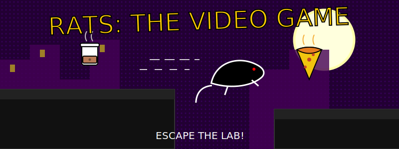

# The Lab

Welcome to **The Lab**! This is a dynamic workspace for experimental projects, creative coding, and digital exploration. Step inside, put on your safety goggles (and maybe some whiskers), and see what's bubbling on the workbench.

## 🧪 Laboratory Rules

To keep the experiments running smoothly, please observe the following protocols:

1.  **Canadian Spelling**: We honour the 'u' in Colour, Behaviour, and Favour. The Centre of our operations is here.
2.  **Conventional Commits**: All contributions must follow the Conventional Commits standard.
3.  **Read AGENTS.md**: This file contains the prime directives. Follow them closely.

---

## 🚀 Active Experiments

### Rats: The Video Game

**Status:** *Containment Breach*

A procedural open-world city game where you assume the role of an escaped lab rat. Scurry through the streets, avoid hazards, and explore the urban jungle.

*   **Objective**: Escape the lab and rule the city.
*   **Tech Stack**: HTML5 Canvas, Web Audio API (16-channel PC Speaker emulation).
*   **Inspiration**: Suzanne Vega's "Rats".
*   **Access**: [Enter the Simulation](./rats-the-video-game)

---

## 📝 Living Visual Journal

This repository is more than just code; it's a living record of our progress. The artwork you see here is part of our commitment to documenting the journey visually.

*   **Art Style**: Modern graphic novel aesthetic with bold outlines and halftone textures.
*   **Updates**: As the lab evolves, so too shall its visual identity. Watch this space for new sketches and schematics.

---

## ⚙️ Technical Specifications

*   **Architecture**: Monorepo managed with `pnpm` workspaces.
*   **Environment**: Web-based (Vanilla JS, Vue.js, Vite).
*   **Deployment**: GitHub Artifacts & Static Site Generation.
