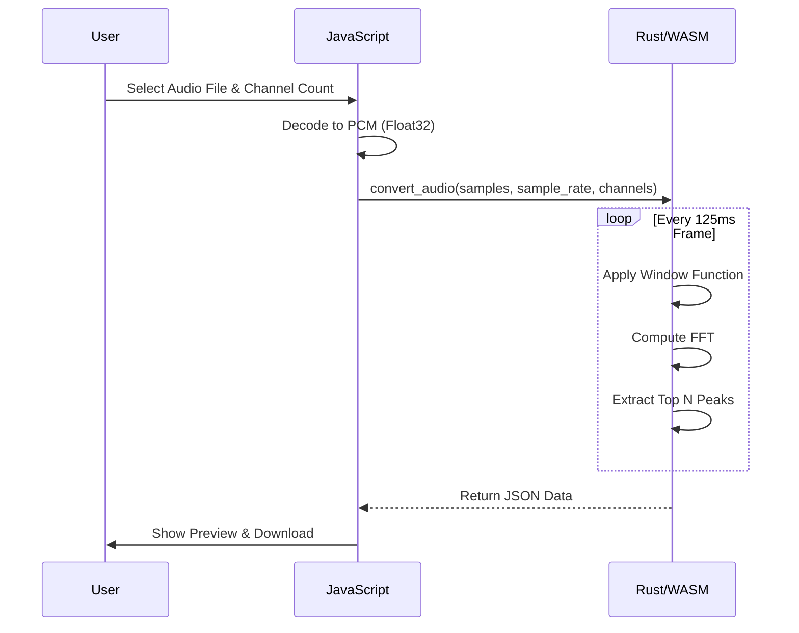

# Rats Music Converter 🐀🎵

Welcome to the **Rats Music Converter**, a specialized tool from The Lab designed to transform high-fidelity audio into the 16-channel "Rat-Bit" format used by *Rats: The Video Game*.

## Overview

This tool uses **Rust** and **WebAssembly (WASM)** to perform Fast Fourier Transform (FFT) analysis on audio files directly in your browser. It extracts the dominant frequencies for each 125ms beat, allowing you to "demake" complex songs into a retro, rat-approved format.

## Architecture

The system is built as a hybrid Rust/JavaScript application.

```mermaid
graph TD
    User[User] -->|Uploads File| UI[Web UI]
    UI -->|Decodes Audio| JS[JavaScript]
    JS -->|Sends PCM Data| WASM[Rust (WASM)]
    WASM -->|FFT Analysis| RustFFT[RustFFT]
    RustFFT -->|Top Frequencies| WASM
    WASM -->|Returns JSON| JS
    JS -->|Synthesizes Sound| WebAudio[Web Audio API]
```

## How It Works

1.  **Input:** User uploads an audio file.
2.  **Decoding:** The browser's AudioContext decodes the file into raw PCM samples (Float32).
3.  **Processing (Rust):**
    -   The samples are sent to the WASM module.
    -   Data is sliced into 125ms windows.
    -   A Hamming window is applied to reduce spectral leakage.
    -   `rustfft` computes the frequency spectrum.
    -   The top N loudest frequencies are extracted.
4.  **Output:** A JSON structure containing time codes and frequency arrays is returned.
5.  **Playback:** The frontend synthesizes the result using simple square waves.



## Local Development (Ubuntu 24.04 Container)

To build this project locally, ensure you have the following installed:

1.  **Rust Toolchain:**
    ```bash
    curl --proto '=https' --tlsv1.2 -sSf https://sh.rustup.rs | sh
    source $HOME/.cargo/env
    rustup target add wasm32-unknown-unknown
    ```

2.  **wasm-pack:**
    ```bash
    curl https://rustwasm.github.io/wasm-pack/installer/init.sh -sSf | sh
    ```

3.  **Node.js & pnpm:**
    (Required for the main site build, though the converter itself handles dependencies via Cargo)

### Building & Running

1.  Navigate to the directory:
    ```bash
    cd rats-music-converter
    ```

2.  Build the WASM module:
    ```bash
    wasm-pack build --target web
    ```
    *Note: This generates a `pkg` directory containing the compiled WASM and JS glue code.*

3.  Serve the `www` directory (ensuring `pkg` is accessible):
    Since `main.js` expects `./pkg`, you might need to symlink or copy `pkg` into `www` for local testing, or serve the root `rats-music-converter` directory and access `www/index.html`.

    ```bash
    # Simple Python server from root of the converter
    python3 -m http.server
    # Open http://localhost:8000/www/
    ```

## Behaviour & Notes

-   **Canadian Spelling:** We strictly enforce the use of "Colour", "Centre", and "Neighbour" in all documentation.
-   **Audio Format:** The tool works best with clear, melodic tracks. Noisy tracks may result in chaotic beeping.

---

```
      __
  ___( o)>
  \ <_. )
   `---'
```
*Rat Infestation Detected.*
