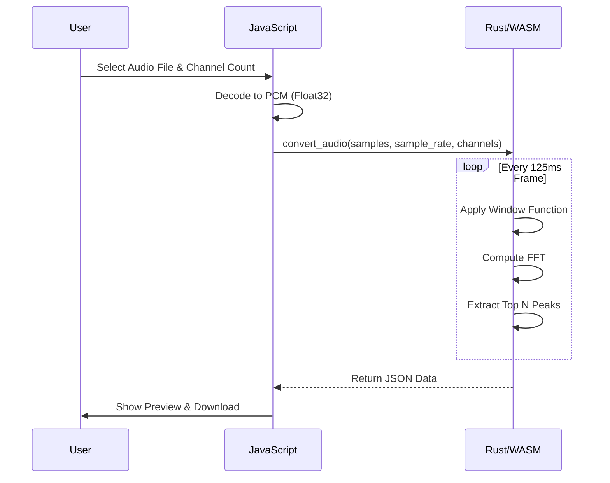

# Rats Music Converter - Implementation Instructions 🐀🎵

This document outlines the plan to build the **Rats Music Converter**, a tool to transform high-fidelity audio into the 16-channel "Rat-Bit" format for *Rats: The Video Game*.

## Goal
Create a web-based tool using **Rust** and **WASM** that allows users to:
1.  Upload an audio file.
2.  Process it using FFT to extract dominant frequencies.
3.  Map these frequencies to 1-16 channels.
4.  Preview the result in the browser.
5.  Download the converted JSON data.

## Technical Stack
-   **Language:** Rust (backend logic), JavaScript (frontend glue).
-   **WASM:** `wasm-bindgen` for communication between Rust and JS.
-   **Audio Processing:** `rustfft` crate.
-   **Frontend:** HTML5, CSS (The Lab aesthetic), Vanilla JS.

## Implementation Steps

### 1. Rust Audio Processing (`src/lib.rs`)
-   **Function Signature:** `pub fn convert_audio(samples: &[f32], sample_rate: u32, num_channels: u8) -> String`
-   **Logic:**
    -   Slice input samples into **125ms windows** (matching the game's beat).
    -   Apply a **Hamming window** to each chunk to reduce spectral leakage.
    -   Perform a **Forward FFT** using `rustfft`.
    -   Calculate magnitudes of complex outputs.
    -   Identify the top `num_channels` (1, 4, 8, or 16) loudest frequencies.
    -   Return a JSON string: `[{ "time": 0.0, "channels": [{ "freq": 440.0, "amp": 0.8 }, ...] }, ...]`.

### 2. Web Frontend (`www/`)
-   **`index.html`:**
    -   File input (`<input type="file">`).
    -   Channel selector (Dropdown: 1, 4, 8, 16).
    -   "Convert" button.
    -   Progress bar.
    -   Result section (Hidden by default):
        -   "Play Preview" / "Stop" buttons.
        -   Canvas visualizer.
        -   "Download JSON" button.
-   **`style.css`:**
    -   Use the "The Lab" aesthetic: Black background, Neon Green (`#33ff00`) text, Monospace font.
-   **`main.js`:**
    -   Initialize WASM (`init()`).
    -   Read file using `FileReader` -> `AudioContext.decodeAudioData`.
    -   Pass `Float32Array` (channel 0) to WASM.
    -   Parse returned JSON.
-   **Preview Player:** Use `AudioContext` to create `OscillatorNode`s for each channel in each frame, with amplitude-weighted gain for smoother behaviour.

### 3. Build & Deployment Integration
-   **`.github/workflows/deploy.yml`:**
    -   Add step to install Rust (`actions-rs/toolchain`).
    -   Add step to install `wasm-pack`.
-   **`build-lab.sh`:**
    -   Navigate to `rats-music-converter`.
    -   Run `wasm-pack build --target web`.
    -   Copy `pkg/` and `www/` contents to `_site/rats-music-converter/`.

## Architecture Diagram

```mermaid
graph TD
    User[User] -->|Uploads File| UI[Web UI]
    UI -->|Decodes Audio| JS[JavaScript]
    JS -->|Sends PCM Data| WASM[Rust (WASM)]
    WASM -->|FFT Analysis| RustFFT[RustFFT]
    RustFFT -->|Top Frequencies| WASM
    WASM -->|Returns JSON| JS
    JS -->|Synthesizes Sound| WebAudio[Web Audio API]
```

## System Pipeline



## Aesthetic Guidelines
-   **Canadian Spelling:** Always use "Colour", "Behaviour", "Centre", etc.
-   **Rat Infestation:** Include ASCII art of rats in comments and footers.
      __
  ___( o)>
  \ <_. )
   `---'
